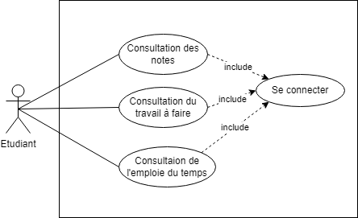

# Projet INFO732 : Meta-Campus

Projet de conception d'une application destinée a aider les étudiants dans leur apprentissage, en leur fournissant des informations pouvant, telles que l’avancement temporel des enseignements, travaux à rendre, niveau de charge de la semaine, situation dans la promo (notes par rapport aux moyennes).

---
## Table des matières
- [Fonctionnalités](#fonctionnalités)
- [Conception](#conception)
- [Utilisation](#utilisation)

---
## Conception
La première étape du projet a été la conception préliminaire de l'application. Cela se traduit par un moment de réflexion sur l'application que nous voulons réaliser, avant de réaliser les diagrammes d'utilisation, Entité-Association,  de séquence et de classe ainsi que la maquette.

*screen maquette*

Voici le modèle Entité-Association de la base de donnée liée à notre application :

*screen Entité Association*

Nous avons implémenté notre base de données avec phpMyAdmin en SQL. 

Nous avons réfléchit à un diagramme de classe qui servira de base à l'implémentation du code :

*screen diagramme de classe*

Les diagrammes de cas d'utilisation nous permettront de définir le comportement de l'application en fonction des requêtes de l'utilisateur :

Voici le diagramme de séquence qui va nous permettre de tracer le chemin des appels de fonction pour chaque requête de l'utilisateur :

*screen diagramme de séquence*

---
## Fonctionnalités
Lors du lancement de l'application, vous arrivez sur cette fenêtre :

*capture d'écran d'écran de la page d'accueil*

Nous pouvons voir sur cette fenêtre :
 - le nom de l'élève et de la promo
 - la charge de travail de la semaine
 - les dernières notes
 - les travaux à rendre et leurs date

A partir de cette page, nous pouvons accéder à l'emploi du temps généré à partir de la base de donnée : 

*screen de l"emploi du temps*

Nous pouvons aussi accéder à l'ensemble des notes de tous les modules, ainsi que les moyennes :

*screens des modules*

Depuis cette page, on peut voir l'avancement du module, les travaux à rendre pour chaque module, les notes et les moyennes de chaque module.

---
## Utilisation

---
### Crédits
Projet conçu et élaboré par GONAY Arthur, GUERIOT Benjamin, NICOLAS Thomas, PACCOUD William, PRUVOST Jordan et TAKAHASHI Vincent
