# Projet INFO732 : Meta-Campus

Projet de conception d'une application destinée a aider les étudiants dans leur apprentissage, en leur fournissant des informations pouvant, telles que l’avancement temporel des enseignements, travaux à rendre, niveau de charge de la semaine, situation dans la promo (notes par rapport aux moyennes).

---
## Table des matières
- [Fonctionnalités](#fonctionnalités)
- [Conception](#conception)
- [Utilisation](#utilisation)

---
## Conception
La première étape du projet a été la conception préliminaire de l'application. Cela se traduit par un moment de réflexion sur l'application que nous voulons réaliser, avant de réaliser les diagrammes d'utilisation, d'état, Entité-Association,  de séquence et de classe ainsi que la maquette.

### Maquettage

Voici la maquette de l'application. Elle permet de visualiser les pages de l'application les liens entre celles-ci. Nous avons essayé d'avoir une page d'accueil avec le maximum d'info disponibles dans l'esprit d'un dashboard afin de rendre l'application plus ergonomique.

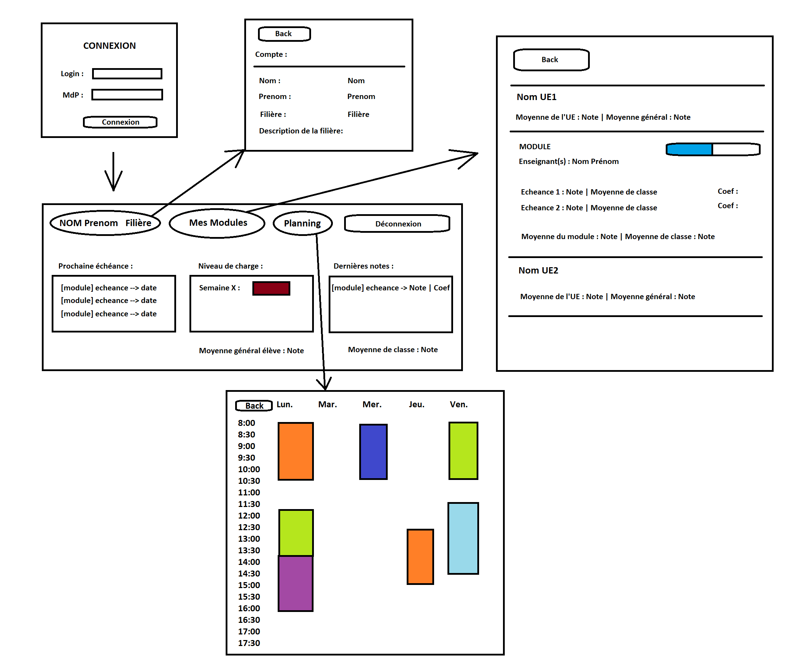

### Modèle E/A

Voici le modèle Entité-Association de la base de donnée liée à notre application, les cardinalitées sont notés suivant la norme d'un MCD MERISE car le modèle a été utilisé pour générer le code sql de crétation de la BDD :

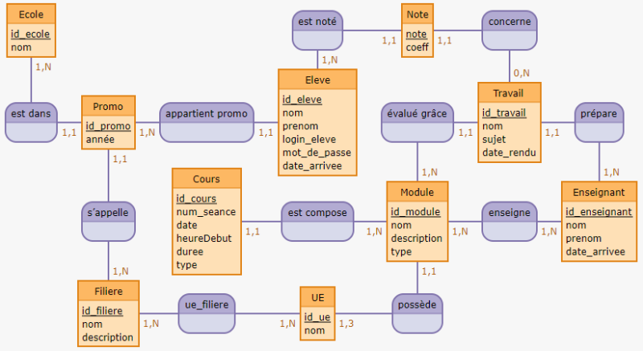

Nous avons implémenté notre base de données avec phpMyAdmin en SQL. 

### Diagramme de classes

Nous avons réfléchit à un diagramme de classe qui servira de base à l'implémentation du code, les cardinalités sont notés suivant la norme UML :

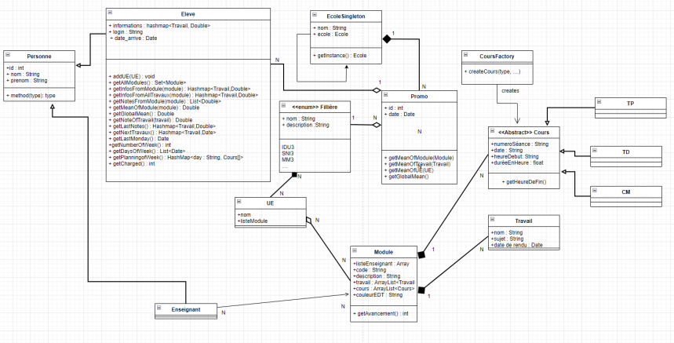

A noter que `Fillière` est une énumération au sens Java, donc un type spécial de classe qui peut posséder des attributs comme une classe normale.

Pour cette application, nous avons implémenté les patterns suivant :

- `Singleton` au travers de la classe Ecole, afin qu'il n'y ait qu'une seule instance d'école contenant la liste de toutes les promos présente dans l'application.
- `Factory` au travers de la classe CoursFactory, qui permet de créer des TP, TD ou CM : différents types de cours avec une durée différentes et potentiellement d'autres attributs.

### Cas d'utilisation

Les diagrammes de cas d'utilisation nous permettront de définir le comportement de l'application en fonction des requêtes de l'utilisateur :

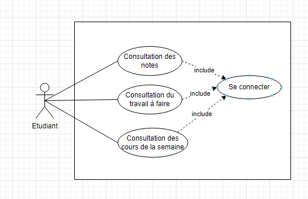

### Diagrammes de séquences

Voici les diagrammes de séquence qui vont nous permettre de tracer le chemin des appels de fonction pour chaque cas d'utilisation :

Connection d'un utilisateur

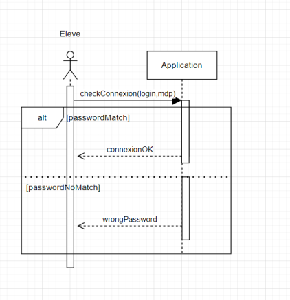

Consulter les cours de la semaine

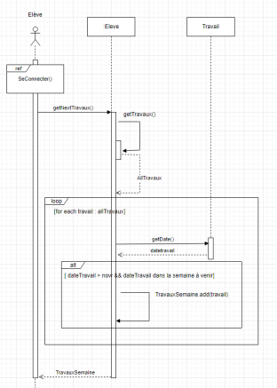

Consulter les travaux à faire

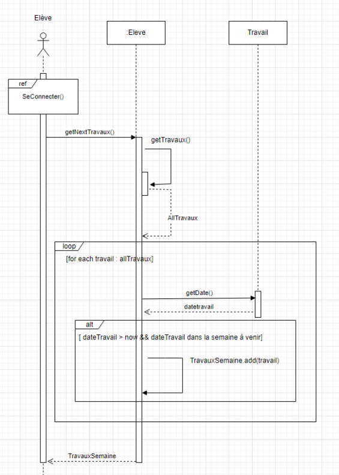

### Diagramme d'états - transitions

Voici le diagramme d'état de notre application, ce dernier nous aide à conceptualiser l'évolution des états de l'applications et donc des différents écrans à présenter à l'utilisateur :

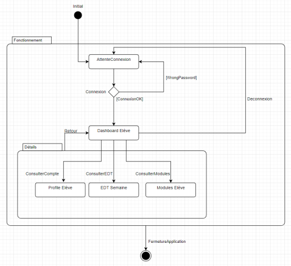

---
## Fonctionnalités
Lors du lancement de l'application, vous devez vous connecter :

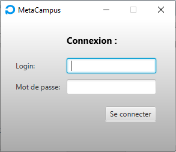

Vous arrivez ensuite sur une page d'accueil :

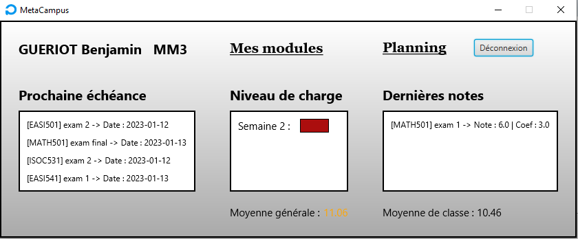

Nous pouvons voir sur cette fenêtre :
 - le nom de l'élève et de la promo
 - la charge de travail de la semaine
 - les dernières notes
 - les travaux à rendre et leurs date

A partir de cette page, nous pouvons accéder à l'emploi du temps généré à partir de la base de donnée en cliquant sur `Planning` : 

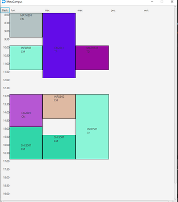

Nous pouvons aussi accéder à l'ensemble des notes de tous les modules, ainsi que les moyennes en cliquant sur `Mes modules` :

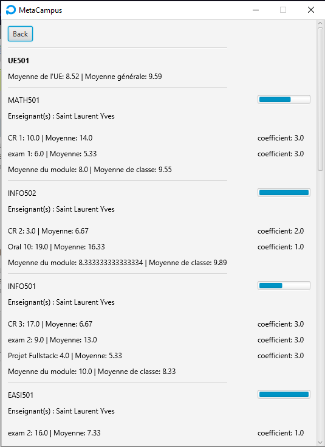

Depuis cette page, on peut voir l'avancement du module en fonction du nombre de cours passés, les travaux à rendre pour chaque module, les notes et les moyennes de chaque module.

---
## Utilisation

Commencez par cloner le git

Exécutez le fichier Main.java

---
### Crédits
Projet conçu et élaboré par GONAY Arthur, GUERIOT Benjamin, NICOLAS Thomas, PACCOUD William, PRUVOST Jordan et TAKAHASHI Vincent
